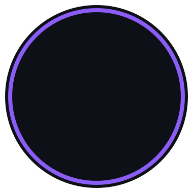

<!-- PROFILE HEADER -->

  

 

  

 

## 💜 About Me

 

I'm **Sara Cervantes**, a Software Development student at **ADSO — SENA Centro Colombo Alemán**, passionate about turning ideas into **useful, well-crafted digital products**.

I'm also studying **Engineering in Artificial Intelligence and Data Science**, combining both fields to build smarter, data-driven applications.

Right now I'm strengthening my skills in **software development, web applications, machine learning, databases and UI design** — I learn best by **building**, and every project is a chance to experiment with something new.

 

## 🏆 Bootcamp Achievement

### 🥉 3rd Place — SuperBrixIA

I participated in an **AI and innovation bootcamp** where I developed **SuperBrixIA**, a solution focused on supporting industrial plant operations through AI-assisted event classification, monitoring and data analysis.

The project integrates an **Android mobile application**, a **FastAPI backend**, **Google Gemini**, **Google Sheets** and **Looker Studio**.

**🏆 Result: 3rd place in the bootcamp**

## 🧠 Tech Stack

 

**Languages**
 

  

**Frameworks & Libraries**
 

  

**Databases & Tools**
 

  

**AI / Data Science**
 

## 🚀 Featured Projects

<table width="100%">
<tr>

<td width="50%" valign="top">

### 🤖 SuperBrixIA — AI for Industrial Operations
Solution developed for an innovation bootcamp to support the registration, classification and analysis of production stops and events.

**Highlights**
- Android app built with Kotlin + Jetpack Compose
- REST API with FastAPI and Python
- AI-assisted classification with Google Gemini
- Event and downtime registration
- Google Sheets integration
- Looker Studio dashboard and KPIs

`Kotlin` `Jetpack Compose` `FastAPI` `Python` `Google Gemini` `Google Sheets`

### 🛍️ Cosmetic Store
A modern e-commerce platform for beauty and cosmetic products.

**Features**
- Product catalog · Shopping cart
- User authentication · Admin dashboard
- Database management

`HTML` `CSS` `JavaScript` `PHP` `MySQL`

</td>

<td width="50%" valign="top">

### 🏨 Hotel Management
A management system designed to organize hotel operations.

**Features**
- Reservation management
- Customer records · Room availability
- Billing system

`Python` `MySQL`

</td>

</tr>
<tr>

<td width="50%" valign="top">

### 🥗 Nutrition Management
A web app focused on personalized nutrition and healthy habits.

**Features**
- Meal tracking · Weight goals
- Progress visualization
- Personalized recommendations

`PHP` `MySQL` `JavaScript`

</td>

<td width="50%" valign="top">

### 📖 WordScape
A vocabulary-learning platform for more interactive English practice.

**Features**
- Daily vocabulary · Interactive exercises
- Learning challenges
- Modern interface

`React` `JavaScript`

</td>

</tr>
</table>

## 🤖 AI & Data Science Projects

Applied machine learning, ETL pipelines and data-driven dashboards

<table width="100%">
<tr>

<td width="50%" valign="top">

### 🏥 HealthAnalytics IPS
Full-stack platform for a healthcare provider with an integrated ML module for clinical analytics.

**Highlights**
- ETL pipeline + statistical analytics
- RandomForest classification model (**66.57%** accuracy)
- JWT auth with role-based access (admin / médico / analista)
- PostgreSQL on Neon Cloud

`Django` `React 19` `PostgreSQL` `Scikit-learn`

</td>

<td width="50%" valign="top">

### 🎓 EduPredict
A student dropout prediction system built to support early academic intervention.

**Highlights**
- RandomForest model trained on academic/behavioral data
- Interactive prediction dashboard
- Clear, actionable risk visualizations

`Python` `Scikit-learn` `Streamlit`

</td>

</tr>
<tr>

<td width="50%" valign="top">

### 🛒 SmartMarket
Classification project analyzing consumer/market data using a KNN model.

**Highlights**
- Data cleaning & preprocessing pipeline
- KNN classification model
- Exploratory data analysis & visualization

`Python` `Scikit-learn` `Pandas`

</td>

<td width="50%" valign="top">

### 📈 Power BI Dashboard Suite
A set of six business-intelligence dashboards covering different real-world datasets.

**Highlights**
- HR · Supermarket sales & products · Used cars
- Consumer complaints · Utilities & margins
- Custom DAX measures & Power Query transformations

`Power BI` `DAX` `Power Query`

</td>

</tr>
</table>

## 📊 GitHub Analytics

 

  

## 🔗 Let's Connect

 

 

### *"Small progress every day leads to big results."*

